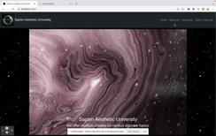

# Sapien Aesthetic University

## Description  
We made this website because we wanted to introduce Sapien Aesthetic University. Anyone can use this website to gain more knowledge about the skin care industry and skin health. Sapien Aesthetic University is an online platform for trusted industry skin care professionals to sell educational courses. The courses can be videos, audio, quizzes, or articles. The goal is to provide students short information that makes complicated science easier to understand.

## Homepage Image:
The following animation demonstrates the application functionality:

## User Story 
As a user I want to search for what I need and get the right information at the first moment. 

* 'WHEN' user goes to the homepage
* 'THEN' user can SEARCH for a class which they are looking for and LOGIN or SIGN Up to their own account

* 'WHEN' user scrolls down 
* 'THEN' user can see different class topics

* 'WHEN' user clicks 'the heart icon'
* 'THEN' user can save it on their account

## Technologies:
* npm
* React
* Mongo 
* Mongoose
* Express 
* Node
* Apollo Server 
* GraphQL 
* Bootstrap 

## Future Development
* For user who has registererd for an account with SAU they can have their own profile and track their progress.
* The user will be able to rate the courses they take 👍 
* Administrators will be able to track their statistics and all data.

## Installation Dependencies:
* npm
* react

## Links to deployed site and Github
* [Deployed Heroku site]
* [Git Repository](https://github.com/ManuelaKenna/SapienAestheticUniversity)
* [Google Presentation] (https://docs.google.com/presentation/d/1vnZHXjSPE2f8KeeoVI1MZrVVnOJeHf74a7_mCUHoFsc/edit?usp=sharing)

## Authors
* Henry He
* Kristin Lynch
* Manuela Kenna 
* Rong Xu
* Scott Gauthier
* Zeinab Hared

